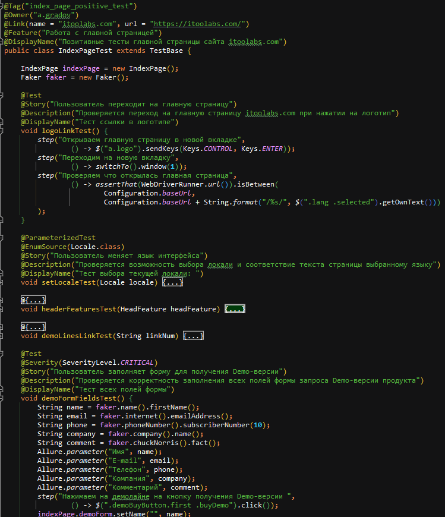
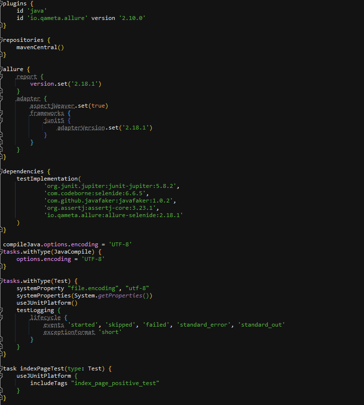

# ITooLabs
Проект автотестов на Java для сайта [ITooLabs](https://itoolabs.com)
___
___

### Содержание

___

### Cтек технологий

___

### Объекты для тестов:

- Главная страница сайта
- Форма запроса Demo-версии продукта
___

### Команды запуска тестов

Команды запуска тестов из терминала с пояснением ключей

### Скриншоты

- Java, JUnit5, Selenide

#### Selenoid

#### Gradle

#### Jenkins

#### Allure

#### GitHub
#### Telegram

- История со скриншотами - где что происходит, запускается
- Гифка с тестом (из видео в selenoid)
- Иконки используемого стека для красоты
- Сделайте джобу в Jenkins, добавьте Allure отчёт, уведомления в чат Telegram, Selenoid.
- Оформите всё со скриншотами в readme.md
